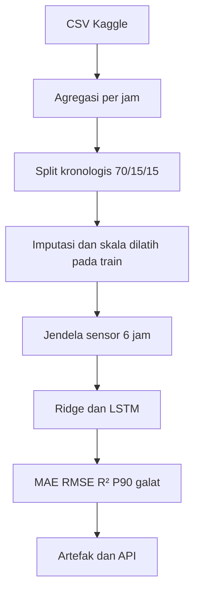

# Soft Sensor Flotasi: Prediksi Mutu Konsentrat Satu Jam ke Depan

Portofolio riset terapan Data Science dan AI Engineering untuk proses pengolahan mineral. Proyek ini menguji apakah riwayat sensor flotasi selama **6 jam** dapat memprediksi **% silika konsentrat pada jam berikutnya**, dibandingkan dengan model linear dan prediksi nilai lab terakhir. Pipeline mencakup agregasi data mentah, pemeriksaan waktu, pelatihan LSTM, evaluasi kronologis, penyimpanan model, dan API inferensi.

> **Batas penerapan:** Dataset Kaggle berasal dari pabrik flotasi **bijih besi**, bukan data PT AMMAN Mineral. AMMAN memproses bijih tembaga, emas, dan perak melalui flotasi. Yang dapat ditransfer adalah pendekatan soft sensor dan rekayasa datanya. Target `% Silica Concentrate`, parameter, serta model terlatih di sini **tidak** mewakili kadar Cu/Au atau kinerja aktual AMMAN. Tidak ada afiliasi, akses data internal, atau klaim penghematan perusahaan.

## Pertanyaan penelitian dan nilai proses

Data lab sering lebih lambat dari pembacaan sensor. Sebuah soft sensor berpotensi membantu operator melihat kecenderungan mutu lebih dini, untuk ditinjau bersama data lab dan insinyur proses. Pertanyaan yang diuji: *apakah LSTM mengurangi MAE pada data masa depan dibandingkan Ridge dan nilai lab terakhir?* Keluaran ini adalah **estimasi dengan ketidakpastian**, bukan kendali otomatis atau dasar keputusan operasi tanpa validasi lapangan.

Untuk adaptasi di departemen proses AMMAN, ganti target dengan kadar Cu/Au, recovery, atau indikator kualitas yang benar-benar diukur; selaraskan historian, timestamp lab, rezim bijih, serta jeda analisis lab; validasi lintas kampanye operasi dan persetujuan tim proses sebelum pilot.

Keterkaitan masalah proses ini didukung oleh [penjelasan AMMAN mengenai optimasi milling, grinding, dan flotasi dengan inovasi AI](https://www.amman.co.id/article/amman-wins-top-asean-award-for-best-mineral-processing-practices). Proyek ini tidak mereplikasi teknologi atau hasil yang disebut AMMAN.

## Data dan sumber

- [Kaggle: Quality Prediction in a Mining Process](https://www.kaggle.com/datasets/edumagalhaes/quality-prediction-in-a-mining-process), berkas `MiningProcess_Flotation_Plant_Database.csv` (sekitar 184 MB; **tidak disalin ke repo/ZIP**). Periksa ketentuan penggunaan pada halaman sumber.
- [AMMAN: praktik pengolahan mineral Batu Hijau](https://www.amman.co.id/article/amman-wins-top-asean-award-for-best-mineral-processing-practices), termasuk optimasi flotasi. Hubungan ke AMMAN adalah kesamaan masalah proses, bukan kesamaan bahan baku atau target.

Dataset memuat sensor proses berfrekuensi tinggi dan hasil lab yang diulang pada beberapa baris dalam jam yang sama. Pipeline membaca CSV per potongan, menghitung rerata per jam dengan pembobotan jumlah observasi sehingga hasil tidak bergantung pada batas potongan, kemudian membentuk urutan 6 jam. Dua pengukuran konsentrat (`% Iron Concentrate` dan `% Silica Concentrate`) **dilarang menjadi fitur model**. Sensor yang dipakai: aliran pati, amina, pulp, pH, densitas pulp, dan aliran udara serta level tujuh kolom flotasi (19 fitur). Fitur lain pada dataset sengaja tidak digunakan agar input dekat dengan peralatan flotasi; keputusan itu perlu diuji ulang bersama tim proses.

### Asumsi waktu yang perlu diverifikasi

Stempel waktu `date` dibulatkan ke awal jam. Rerata sensor dari jam `t-5` hingga `t` dipakai untuk memperkirakan hasil lab di jam `t+1`. Baris lab dalam satu jam dirata-ratakan, sehingga definisi timestamp dan waktu *tersedianya* hasil lab harus diperiksa pada sumber operasional sebelum penerapan. Baseline "lab terakhir" menganggap hasil pada jam `t` sudah tersedia ketika prediksi dibuat; ini mungkin terlalu optimistis jika lab terlambat. Evaluasi offline belum mensimulasikan latensi tersebut.

## Rancangan eksperimen



| Tahap | Kebijakan |
| --- | --- |
| Train/validasi/test | 70%/15%/15% jam berurutan; batas split dicatat dalam metadata |
| Celah waktu | Jendela yang melintasi jam hilang dibuang; jendela tidak melintasi batas split |
| Missing sensor | Median per fitur dihitung dari train saja; nilai inf diperlakukan sebagai hilang |
| Skala | `StandardScaler` dilatih pada baris sensor train saja |
| Baseline | Persistence dari hasil lab terakhir dan Ridge pada sensor jam terakhir |
| LSTM | 32 unit, dense 16, early stopping di validasi; tanpa pencarian hiperparameter di test |
| Metrik | MAE, RMSE, R², P90 galat absolut; satuan target adalah poin persentase silika |

**Kriteria keputusan:** LSTM baru layak dieksplorasi lebih jauh bila MAE test lebih kecil daripada kedua baseline, performa stabil antarperiode dan rezim proses, serta latensi, kualitas input, dan kalibrasi pengukuran teruji. Hasil pada satu dataset publik tidak membuktikan manfaat untuk AMMAN.

## Instalasi dan cara menjalankan

Eksperimen dan API diuji dengan **Python 3.12** serta versi dependensi yang tercatat di `requirements.txt`. TensorFlow CPU mungkin membutuhkan beberapa menit untuk dipasang; instalasi GPU atau platform lain perlu penyesuaian lingkungan.

```bash
python -m venv .venv
source .venv/bin/activate       # Windows: .venv\\Scripts\\activate
python -m pip install -r requirements.txt
python -m src.unduh_data        # unduh dataset publik via kagglehub
python -m src.latih --csv data/MiningProcess_Flotation_Plant_Database.csv --epochs 30
python -m pytest -q
uvicorn src.api:app --host 127.0.0.1 --port 8000
```

Jika unduhan otomatis terhalang aturan jaringan Kaggle, ambil CSV langsung dari tautan dataset dan simpan pada `data/MiningProcess_Flotation_Plant_Database.csv`. Jalankan pelatihan dulu sebelum API. Untuk menjalankan API setelah pelatihan: `docker build -t soft-sensor-flotasi .` lalu `docker run --rm -p 8000:8000 soft-sensor-flotasi`. Container hanya berguna bila `artifacts/` sudah berisi model terlatih.

Contoh request API dapat dibuat dengan `python -m src.contoh_api > payload.json`, lalu:

```bash
curl -X POST http://127.0.0.1:8000/prediksi \
  -H 'Content-Type: application/json' -d @payload.json
```

`GET /health` melaporkan kesiapan model; `POST /prediksi` meminta tepat 6 observasi sensor per jam secara berurutan, seluruh 19 nama fitur, dan memberi estimasi silika untuk satu jam setelah observasi terakhir. Contoh payload memakai **median sensor train yang diulang**, bukan observasi tambang atau prediksi bermakna. API menolak urutan waktu yang tidak lengkap, nilai nonfinite, fitur kurang, sensor di luar persentil 0,5–99,5 dari train, dan hasil di luar 0–100%. Batas per fitur tidak menangkap semua kombinasi sensor yang asing; endpoint belum memiliki autentikasi atau pemantauan drift.

## Hasil dan reproduksibilitas

Eksperimen dijalankan pada CSV Kaggle asli (4.097 jam teramati; 2.855 jendela train, 609 validasi, 609 test; seed 42, maksimum 15 epoch dengan early stopping pada epoch 8). Periode test: **15 Agustus sampai 9 September 2017**. Satuan galat adalah **poin persentase silika**.

| Model | MAE test ↓ | RMSE test ↓ | R² test ↑ | P90 galat absolut ↓ |
| --- | ---: | ---: | ---: | ---: |
| Nilai lab terakhir | **0,4755** | **0,7638** | **0,5953** | **1,2160** |
| Ridge, sensor jam terakhir | 1,0429 | 1,3711 | −0,3041 | 2,4150 |
| LSTM, 6 jam sensor | 1,0452 | 1,3723 | −0,3064 | 2,4513 |

**Interpretasi:** Hipotesis keunggulan LSTM **tidak didukung** pada periode test. LSTM juga sedikit lebih buruk daripada Ridge; kedua model berbasis sensor jauh tertinggal dari nilai lab terakhir. Oleh karena itu hasil model ini **tidak layak diklaim sebagai peningkatan proses**. Baseline lab mengasumsikan hasil terakhir sudah tersedia tanpa keterlambatan; bila jeda lab sebenarnya panjang, perlu evaluasi ulang menggunakan waktu rilis lab yang benar. Perubahan distribusi dan hubungan sensor-target pada periode test memerlukan analisis lebih lanjut. Pelatihan ulang dengan data proses tembaga/emas dan target operasional yang relevan tetap diperlukan.

Artefak **hasil pelatihan nyata** disertakan: `artifacts/metrics.json`, `artifacts/prediksi_test.csv`, `artifacts/model.keras`, `artifacts/preprocessor.joblib`, `artifacts/ridge.joblib`, dan `artifacts/laporan_hasil.md`. `metrics.json` mencatat batas split, jumlah sampel, dan metrik; CSV menyimpan prediksi test per jam untuk audit. Jalankan perintah pelatihan untuk mereproduksi hasil (perbedaan kecil mungkin muncul karena lingkungan komputasi). Dataset mentah tidak disalin ke ZIP/repo dan diabaikan Git.

Kegagalan penting untuk dianalisis: pergantian jenis bijih, perubahan setpoint, sensor macet, jam tanpa data, distribusi target berubah, dan keterlambatan lab. Roadmap sebelum pilot: validasi metadata lab dan proses, split tambahan berdasarkan periode operasi, prediksi interval/kalibrasi galat, monitoring drift dan kualitas sensor, shadow deployment, serta tinjauan bersama metallurgist dan pemilik proses.

## Struktur proyek

```text
soft-sensor-flotasi-lstm/
├── README.md
├── requirements.txt
├── artifacts/              # model dan hasil eksperimen asli
├── Dockerfile
├── .dockerignore
├── .gitignore
├── src/
│   ├── data.py             # ETL streaming, jendela, split waktu
│   ├── unduh_data.py       # pengambilan data Kaggle
│   ├── latih.py            # baseline, LSTM, evaluasi, artefak
│   ├── api.py              # layanan prediksi FastAPI
│   └── contoh_api.py       # payload contoh
└── tests/
    └── test_temporal.py    # pemeriksaan celah, split, agregasi
```

## Referensi

1. [Quality Prediction in a Mining Process, Kaggle](https://www.kaggle.com/datasets/edumagalhaes/quality-prediction-in-a-mining-process).
2. [PT Amman Mineral Internasional Tbk, uraian praktik pengolahan mineral](https://www.amman.co.id/article/amman-wins-top-asean-award-for-best-mineral-processing-practices).

Proyek independen untuk portofolio; bukan hasil penelitian atau pernyataan resmi AMMAN.
